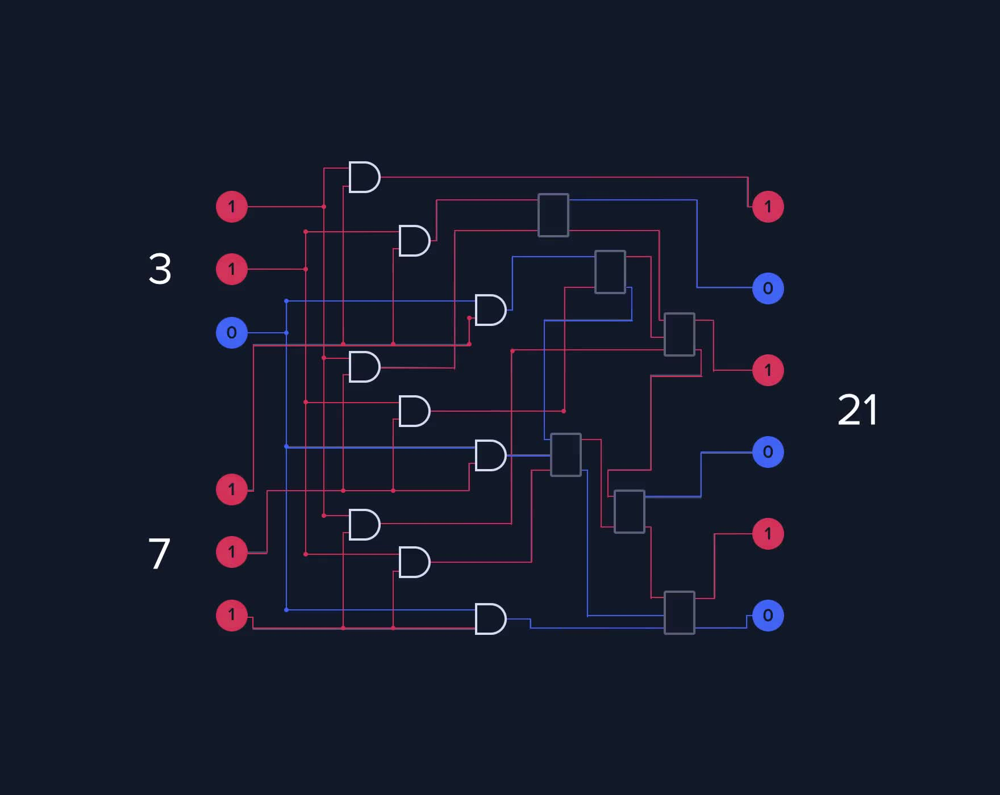

[](
  https://circleci.com/gh/dwave-examples/factoring-notebook)

# Factoring

This notebook explains the quantum processing unit (QPU) programming model used
for factoring, and shows how to implement it.

The notebook has the following sections:

1. **Factoring as a Constraint Satisfaction Problem** describes the factoring
   problem as an example CSP.
2. **Formulating the Problem for a D-Wave Quantum Computer** shows how such CSPs
   can be formulated for solution on a quantum computer.
3. **A Simple Example** codes a small CSP to clarify the solution technique.
4. **Factoring on the Quantum Computer** codes a factoring problem for solution
   on a D-Wave quantum computer.
5. **Further Information** details some points touched on in previous sections
   and examines more closely the results returned from the quantum computer.

## Factoring as a Constraint Satisfaction Problem

The [complexity class](https://en.wikipedia.org/wiki/Complexity_class) for classical
integer factoring is believed to be between P and NP-hard.  Although research has
yielded algorithms that perform faster than the intuitive trial division, including
Fermat's algorithm, Pollard's two algorithms, and sieve algorithms, it's still an
open question whether a classical algorithm exists that can factor in
[polynomial time](https://en.wikipedia.org/wiki/Time_complexity). For quantum
computing, Shor's algorithm runs in polynomial time (D-Wave quantum computers do
not run this algorithm).

This notebook solves factoring on a D-Wave quantum computer by formulating it as
a [constraint satisfaction problem](https://docs.ocean.dwavesys.com/en/stable/concepts/csp.html).
CSPs require that all a problem's variables be assigned values that result in the
satisfying of all constraints. For factoring, the problem's constraints are that
the two variables representing factors, ``a`` and ``b``, be assigned only natural
numbers and that their multiplication be equal to the factored number, ``P``.



## Installation

You can run this example without installation in cloud-based IDEs that support 
the [Development Containers specification](https://containers.dev/supporting)
(aka "devcontainers").

For development environments that do not support ``devcontainers``, install 
requirements:

    pip install -r requirements.txt

If you are cloning the repo to your local system, working in a 
[virtual environment](https://docs.python.org/3/library/venv.html) is 
recommended.

## Usage

Your development environment should be configured to 
[access Leap’s Solvers](https://docs.ocean.dwavesys.com/en/stable/overview/sapi.html).
You can see information about supported IDEs and authorizing access to your 
Leap account [here](https://docs.dwavesys.com/docs/latest/doc_leap_dev_env.html).  

The notebook can be opened by clicking on the 
``01-factoring-overview.ipynb`` file in VS Code-based IDEs. 

To run a locally installed notebook:

```bash
jupyter notebook
```

## License

Released under the Apache License 2.0. See LICENSE file.
